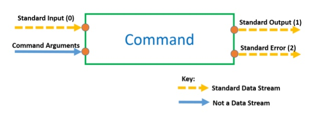

# **Command Input and Output**

&nbsp;

&nbsp;

Standard Data Streams can be `redirected` and are identified using their stream number.

Redirection of the standard output of one command to the standard input of another 
command is known as `piping`.

&nbsp;

## **Redirecting Standard Output:**

&nbsp;

`Standard output` is stream number `1`. There are 2 methods to redirect standard output.

The *long form*, using the stream number:

&nbsp;&nbsp;&nbsp;&nbsp;  <kbd>command_name</kbd> `-options` <mark>arguments</mark> 1> destination

&nbsp;

Or the *short form*, with no stream number:

&nbsp;&nbsp;&nbsp;&nbsp;  <kbd>command_name</kbd> `-options` <mark>arguments</mark> > destination

&nbsp;

## **Redirecting Standard Error:**

&nbsp;

`Standard error` is stream number `2`.

Here is how to redirect standard error

&nbsp;&nbsp;&nbsp;&nbsp;  <kbd>command_name</kbd> `-options` <mark>arguments</mark> 2> destination

&nbsp;

Standard error can be redirected at the same time as standard output:

&nbsp;&nbsp;&nbsp;&nbsp; <kbd>command_name</kbd> `-options` <mark>arguments</mark> 1> output_destination 2> error_destination

&nbsp;

## **Redirecting Standard Input:**

&nbsp;

`Standard Input` is stream number `0`. There are 2 methods to redirect standard input.

The *long form*, using the stream number:

&nbsp;&nbsp;&nbsp;&nbsp; <kbd>command_name</kbd> `-options` <mark>arguments</mark> 0< input_source

&nbsp;

Or the *short form*, with no stream number:

&nbsp;&nbsp;&nbsp;&nbsp; <kbd>command_name</kbd> `-options` <mark>arguments</mark> < input_source